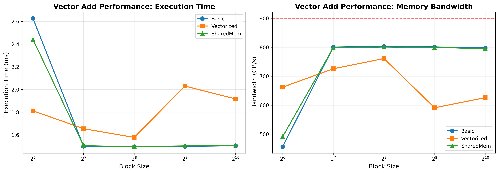

# CUDA算子性能对比项目

AI-infra岗位准备项目，用于对比NVIDIA和华为显卡上不同算子实现的性能差异。

## 项目结构

```
.
├── nvidia/
│   └── kernels/
│       └── vector_add/          # Vector Add算子的三种实现
│           ├── basic.cu         # 基础实现：每线程处理一个元素
│           ├── vectorized.cu    # 向量化实现：每线程处理多个元素
│           └── shared_mem.cu    # 共享内存优化实现
├── huawei/
│   └── kernels/                 # 华为显卡算子实现（待添加）
├── tests/
│   ├── test_vector_add.cu       # C++测试程序
│   ├── test_vector_add_cupy.py  # Python性能测试脚本
│   ├── benchmark_block_sizes.py # Block size性能基准测试
│   └── plot_results.py          # 性能可视化脚本
├── benchmarks/                  # 性能基准测试
├── include/                     # 公共头文件
├── common/                      # 公共工具代码
└── Makefile                     # 编译脚本
```

## 环境要求

- CUDA Toolkit 12.x或更高版本
- Python 3.x
- cupy-cuda12x
- matplotlib (用于可视化)
- NVIDIA GPU (测试使用Tesla V100)

## 安装依赖

```bash
pip3 install cupy-cuda12x matplotlib numpy
```

## 编译

```bash
# 使用完整路径编译共享库
/usr/local/cuda/bin/nvcc -O3 -gencode arch=compute_70,code=sm_70 \
    -Xcompiler -fPIC -shared -o libvector_add.so \
    nvidia/kernels/vector_add/*.cu

# 编译C++测试程序
/usr/local/cuda/bin/nvcc -O3 -gencode arch=compute_70,code=sm_70 \
    -o test_vector_add tests/test_vector_add.cu \
    nvidia/kernels/vector_add/*.cu
```

注意：根据你的GPU架构调整 `-gencode` 参数（如sm_75, sm_80, sm_86等）

## 运行测试

### 1. C++功能测试
```bash
./test_vector_add [数组大小] [Block大小]
# 示例
./test_vector_add 1000000 256
```

### 2. Python性能测试
```bash
python3 tests/test_vector_add_cupy.py [库路径] [数组大小] [Block大小]
# 示例
python3 tests/test_vector_add_cupy.py ./libvector_add.so 100000000 256
```

### 3. Block Size基准测试
```bash
python3 tests/benchmark_block_sizes.py [数组大小]
# 示例
python3 tests/benchmark_block_sizes.py 100000000
```

### 4. 生成性能可视化图表
```bash
python3 tests/plot_results.py
```

## Vector Add三种实现说明

### 1. Basic实现 (basic.cu)
- 最简单的实现方式
- 每个线程处理一个元素：`c[idx] = a[idx] + b[idx]`
- 适合理解CUDA基本编程模型
- **性能特点**：在block size=128-256时达到最优性能（~800 GB/s）

### 2. Vectorized实现 (vectorized.cu)
- 使用grid-stride loop模式
- 每个线程处理多个元素，减少线程调度开销
- 代码模式：
```cuda
for (int i = idx; i < n; i += stride) {
    c[i] = a[i] + b[i];
}
```
- **性能特点**：在小block size（64）时表现最好（662 GB/s），大block size时性能下降

### 3. SharedMem实现 (shared_mem.cu)
- 使用共享内存缓存数据
- 先将数据加载到shared memory，再进行计算
- **性能特点**：对于vector add这种无数据重用的操作，性能与Basic相当，因为额外的内存拷贝抵消了优势

## 性能测试结果

### 测试环境
- GPU: Tesla V100-PCIE-32GB (Compute Capability 7.0)
- 数组大小: 100,000,000 个float32元素
- 理论峰值带宽: ~900 GB/s

### 不同Block Size性能对比

| Block Size | Basic (ms) | Vectorized (ms) | SharedMem (ms) |
|------------|------------|-----------------|----------------|
| 64         | 2.628 (456.6 GB/s) | **1.812 (662.3 GB/s)** | 2.442 (491.4 GB/s) |
| 128        | **1.499 (800.6 GB/s)** | 1.654 (725.7 GB/s) | 1.503 (798.2 GB/s) |
| 256        | **1.495 (802.7 GB/s)** | 1.577 (761.1 GB/s) | 1.498 (800.8 GB/s) |
| 512        | **1.498 (801.1 GB/s)** | 2.030 (591.1 GB/s) | 1.502 (799.1 GB/s) |
| 1024       | **1.504 (797.7 GB/s)** | 1.917 (626.0 GB/s) | 1.509 (795.4 GB/s) |

### 性能分析



#### 关键发现：

1. **Basic实现已经很优**：在合适的block size（128-256）下，Basic实现就能达到~800 GB/s的带宽，接近V100理论峰值的89%

2. **Vectorized的优势场景**：
   - 在小block size（64）时表现最好，因为减少了需要启动的block数量
   - 在大block size时反而变慢，因为grid数量太少，GPU利用率不足

3. **SharedMem的局限性**：
   - 对于vector add这种每个元素只访问一次的操作，shared memory没有带来优势
   - 额外的global→shared→global拷贝反而增加了开销
   - 适用于有数据重用的场景（如矩阵乘法、卷积等）

4. **Block Size的影响**：
   - 太小（64）：线程数不足，无法充分利用GPU
   - 太大（1024）：寄存器和shared memory压力大，occupancy下降
   - 最优范围：128-256

## 为什么看不出明显差距？

对于vector add这种**内存带宽受限**的简单操作：
- 计算量极小（只有一次加法）
- 完全受内存带宽限制
- 三种实现都能达到接近硬件峰值的性能

要看出优化效果，需要：
- 更复杂的计算密集型算子（如矩阵乘法、卷积）
- 有数据重用的场景（shared memory才有优势）
- 需要更多计算的操作（才能体现计算优化）

## 后续扩展计划

- [ ] 添加矩阵乘法算子（展示shared memory优势）
- [ ] 添加reduction算子（展示warp-level优化）
- [ ] 添加华为昇腾显卡实现
- [ ] 添加更详细的性能分析工具（nsight profiling）
- [ ] 添加自动化benchmark框架

## 参考资料

- [CUDA C Programming Guide](https://docs.nvidia.com/cuda/cuda-c-programming-guide/)
- [CUDA Best Practices Guide](https://docs.nvidia.com/cuda/cuda-c-best-practices-guide/)
- [V100 Whitepaper](https://images.nvidia.com/content/volta-architecture/pdf/volta-architecture-whitepaper.pdf)
